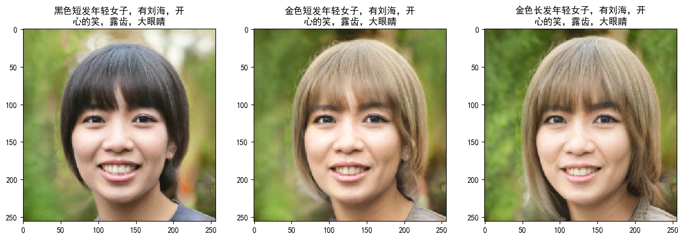

## StyleGAN Bert &mdash; convert text to face 

*You can convert text to face image!!! Thanks to @Puzer and @pbaylies for the original style Encoder*

Short explanation of encoding approach:

0) Bert is used for transforming sentence to embedding
1) Original pre-trained StyleGAN generator is used for generating images
2) Pre-trained ResNet network is used for transforming a reference image and generated image into high-level features space
3) Simple Model is used for transforming Text Embedding and image into high-level features space

**More examples you can find in the [Jupyter notebook](https://github.com/aloyschen/TextToFace/blob/master/play_text_to_face.ipynb)**

### Generating latent representation of your images
You can generate latent representations of your own images using two scripts:
1) Extract and align faces from images
> python align_images.py raw_images/ aligned_images/

2) Download the stylegan pre-train model ([百度云链接](https://pan.baidu.com/s/1CuTKhAG2cdDo_RV5E6V9FA)), put the stylegan.pkl to model folder

3) Training ResNet50 encoder
train your own with trainResnet.py or download my [pre-trained model](https://pan.baidu.com/s/14QaGTltjpeErBVM23jGIFw)! Put the model in model/finetuned_resnet.h5 
[Origin github](https://github.com/pbaylies/stylegan-encoder/blob/master/README.md)

4) Find latent representation of aligned images
> python encode_images.py aligned_images/ generated_images/ latent_representations/

### Generating sentence embedding
You can generate sentence embedding with [bert-as-service](https://github.com/hanxiao/bert-as-service)
1) Install bert-serving
> pip install bert-serving-server 

> pip install bert-serving-server
2) Start the BERT service
> bert-serving-start -model_dir ./model/chinese_L-12_H-768_A-12 -num_worker=4 

bert chinese model download [百度云](https://pan.baidu.com/s/1YNtlySQlqFmcDgTMuRKO7w)

### Generating your own text and image dataset
You can describe face image by yourself, like this:
>48889.png	黑色短发年轻女子，有刘海，开心的笑，露齿，大眼睛 
48872.png	黑色短发青年男子，戴墨镜，侧面

Used image from [FHHQ dataset](https://github.com/NVlabs/ffhq-dataset)

### Train text embedding model
The model is simple with some Dense layer
> python trainTextToFace.py
